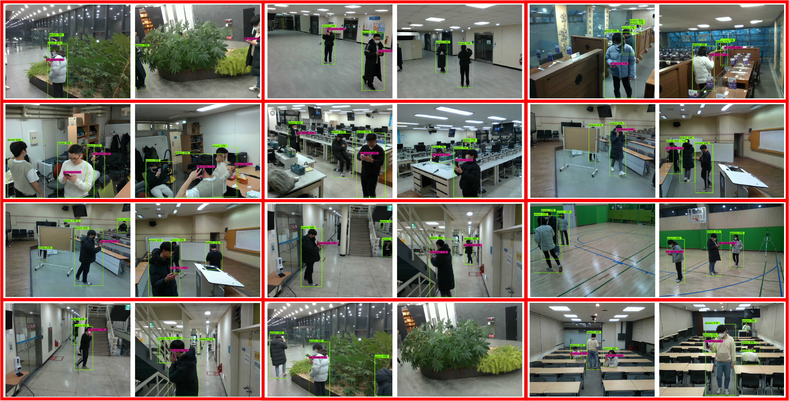

# VOBEM2: Vision Objects for Beam Management (Version 2)

VOBEM2 is a vision dataset specially designed for the evaluation of the multi-view computer vision-aided wireless communicatons (multi-view CVWC) performance in millimeter and THz communication scenarios.
It consists of 200 pairs of RGB and depth images taken from different angles.

For more details of this work, see the paper "Role of Computer Vision in 6G Wireless Communications", in preparation for IEEE Wireless Communications http://isl.snu.ac.kr/publication.

## Preparation

In VOBEM2, we store the images and corresponding labels in two different folders named ‘image’ and ‘label’, respectively. To be specific, in the ‘image’ folder, there are three subfolders named ‘rgb’, ‘depth’, and ‘distance’. The ‘rgb’ subfolder contains RGB images, while the ‘depth’ subfolder contains corresponding depth images. In the ‘distance’ subfolder, the distance to the point in each pixel is included. This information is available in JSON format. On the other hand, the ‘label’ folder provides labels for images of VOMM in XML format. Each label includes the width, height, and depth of the image, as well as objects labeled with one of the three classes and their bounding box coordinates. Specifically, persons are labeled as ‘person’ and cell phones as ‘P’.
